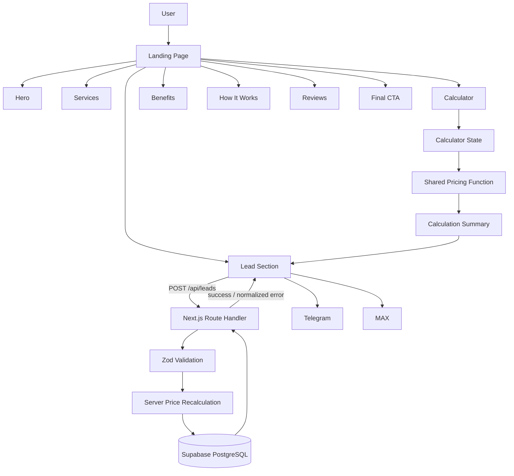
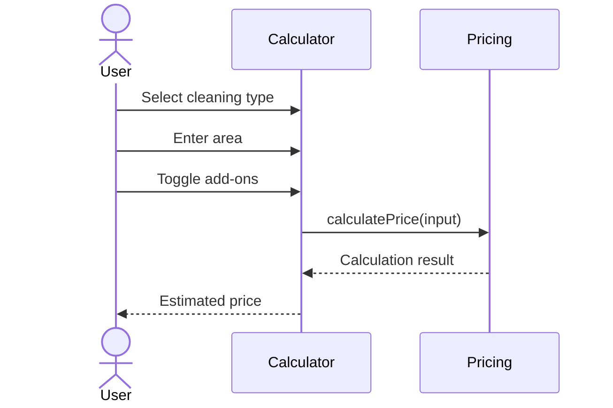
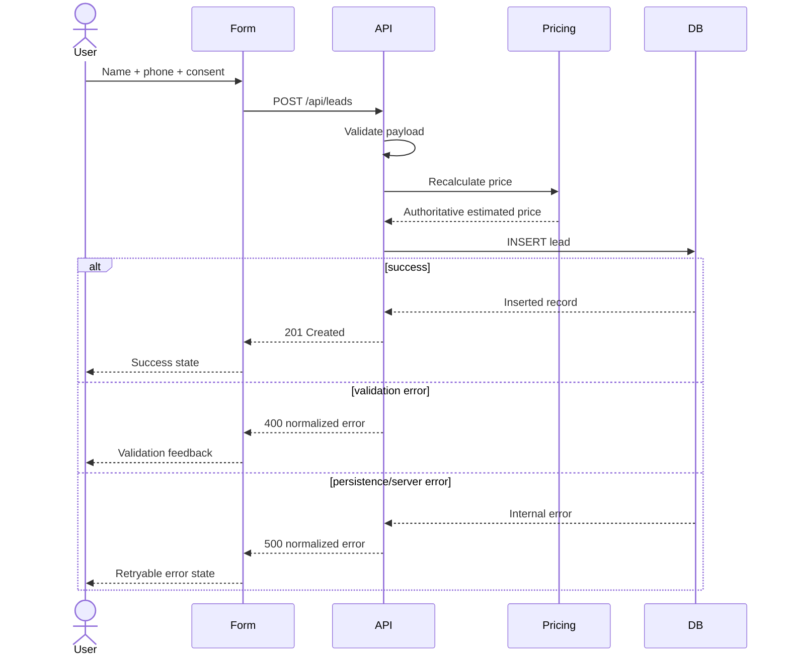

# Architecture: “Clean Square”

## 0. Architecture Contract

This document is self-contained for implementation decisions and is subordinate to `TZ.md` for product scope. The external technology baseline was re-verified for **2026-09-23**.

Canonical names and data contracts:

- persisted submission: `Lead`; “request” is UI copy only; do not introduce an `Order` domain model;
- cleaning IDs: `maintenance`, `deep`, `post-renovation`;
- optional service term: **add-on**; IDs: `windows`, `fridge`, `oven`; domain/API field: `addOns`; database column: `add_ons`;
- calculator output: `Calculation` / calculation summary;
- section name: `How It Works`; component: `HowItWorks.tsx`;
- `area`: integer 10–500 inclusive;
- prices: integer RUB;
- `name`: trimmed 2–80 characters;
- `phone`: trimmed 7–32 characters, allowed digits/spaces/`+`/parentheses/hyphen, 7–15 digits after formatting is removed;
- `consent`: exactly `true`;
- public contacts: environment variables are read centrally by `src/config/site.ts`; components do not read env values directly.

---

## 1. Architecture Goal

The architecture exists to support one primary business flow with minimal complexity:

```text
landing page
   ↓
price calculator
   ↓
calculation summary
   ↓
lead form
   ↓
server-side validation
   ↓
server-side price recalculation
   ↓
lead persistence
   ↓
success state
```

This is intentionally a small single-application architecture. Microservices, a separate backend, a global state-management framework, and speculative infrastructure are out of scope.

---

## 2. Verified Technology Baseline — 2026-09-23

| Technology | Project baseline | Reason / verified state |
|---|---|---|
| Node.js | 24 LTS | LTS runtime; Node 26 is Current, so 24 is the production baseline |
| Next.js | 16.3.6 | 16.x Active LTS; includes the 2026-09-22 security update |
| React | Next.js-managed compatible version | React 19.3 is current stable upstream; App Router React packages must stay aligned with the selected Next.js scaffold |
| TypeScript | Strict mode | Strong contracts for domain data and API boundaries |
| Tailwind CSS | 4.3 | Current v4 line on the verification date |
| Zod | 4.6 | Current stable validation line on the verification date |
| Supabase | Hosted PostgreSQL + JS client | Minimal persistence infrastructure for leads |
| Supabase key model | `sb_secret_...` on server | New secret keys replace legacy `service_role` for new work |
| Vitest | 5.x | Unit-test baseline; requires Node >=22.12 and Vite >=6.4 |
| Vite | 8.3 | Explicit Vitest peer/test dependency; not the Next.js application bundler |
| Playwright | 1.63 | Current stable E2E line on the verification date |
| Vercel | Managed Next.js deployment | Deployment target |

Official verification anchors are the Node.js release table, Next.js support/blog, React 19.3 release post, Tailwind 4.3/compatibility docs, Zod 4.6 release post, Vitest 5 migration guide, Vite releases page, Playwright release notes, and Supabase API-key migration guide.

### Version Policy

- Commit and keep the lockfile.
- Do not use Next.js versions older than **16.3.6** in the 16.x line for this baseline.
- Prefer compatible security patch upgrades.
- Do not upgrade a major dependency during feature work unless the task explicitly requires it.
- If a dependency upgrade changes behavior or architecture, update this document and the project plan.

---

## 3. System Overview



---

## 4. Architectural Layers

### 4.1. Presentation Layer

Responsibilities:

- render landing-page sections;
- collect calculator inputs;
- display estimated price;
- collect lead-form input;
- render loading, success, and error states.

The presentation layer must not own independent copies of pricing rules or database logic.

### 4.2. Domain Layer

Contains business rules that are independent of React and Next.js:

- cleaning-service identifiers and types;
- add-on identifiers and types (`windows`, `fridge`, `oven`);
- pricing configuration types;
- price calculation;
- area constraints;
- calculation result types.

Primary invariant:

**Pricing logic must remain framework-independent and reusable by both browser and server code.**

### 4.3. Validation Layer

Contains runtime schemas for untrusted input.

Responsibilities:

- lead payload validation;
- cleaning type validation;
- add-on validation;
- integer area range validation (10–500 inclusive);
- `name` and `phone` constraints from Section 0;
- consent validation (`true` only).

Schemas may be shared by client and server only if they contain no server-only imports.

### 4.4. Application / API Layer

The Next.js route handler orchestrates a lead submission:

1. parse request body;
2. validate with Zod;
3. recalculate the price from trusted configuration;
4. construct the persistence record;
5. call server persistence code;
6. return a normalized response.

It must not trust a total submitted by the browser.

### 4.5. Infrastructure Layer

Contains server-only integration with Supabase.

Responsibilities:

```text
validated lead → database insert → persistence result
```

The infrastructure layer owns Supabase client initialization and must never be imported into client components.

---

## 5. Application State

A global state manager is not used.

Calculator input:

```ts
type CalculationInput = {
  cleaningType: CleaningTypeId;
  area: number | null;
  addOns: AddOnId[];
};
```

The price is derived from input rather than stored as an independently mutable value:

```text
calculation input
      ↓
calculatePrice()
      ↓
calculation result
```

This avoids stale or inconsistent totals.

The smallest reasonable shared client boundary should own the calculation state required by both `Calculator` and `LeadForm`.

---

## 6. Domain Model

### CleaningService

```ts
type CleaningService = {
  id: CleaningTypeId;
  title: string;
  description: string;
  pricePerM2: number;
  minPrice: number;
};
```

### AddOnService

```ts
type AddOnService = {
  id: AddOnId;
  title: string;
  price: number;
};
```

### Calculation

```ts
type Calculation = {
  cleaningType: CleaningTypeId;
  area: number;
  addOns: AddOnId[];
  totalPrice: number;
};
```

### Lead

```ts
type Lead = {
  id: string;
  name: string;
  phone: string;
  cleaningType: CleaningTypeId;
  area: number;
  addOns: AddOnId[];
  calculatedPrice: number;
  consent: boolean;
  createdAt: string;
};
```

---

## 7. Pricing Architecture

Single pricing source:

```text
src/config/pricing.ts
```

Canonical configuration values:

| ID | Cleaning type | RUB/m² | Minimum RUB |
|---|---|---:|---:|
| `maintenance` | Maintenance cleaning | 45 | 2500 |
| `deep` | Deep cleaning | 90 | 4500 |
| `post-renovation` | Post-renovation cleaning | 120 | 6000 |

| ID | Add-on | RUB |
|---|---|---:|
| `windows` | Window cleaning | 1500 |
| `fridge` | Refrigerator interior cleaning | 700 |
| `oven` | Oven interior cleaning | 700 |

These are project demo assumptions, not externally verified market prices.

Pure pricing logic:

```ts
const basePrice = Math.max(
  service.minPrice,
  service.pricePerM2 * area,
);

const totalPrice =
  basePrice +
  selectedAddOns.reduce((sum, extra) => sum + extra.price, 0);
```

The same domain function is used:

- in the browser for instant preview;
- on the server for authoritative recalculation.

The browser total is display data, not trusted persistence data.

---

## 8. Calculator Flow



No network request is required for each calculator change.

---

## 9. Lead Submission Flow



---

## 10. API Contract

### `POST /api/leads`

Example request:

```json
{
  "name": "Anna",
  "phone": "+79990000000",
  "cleaningType": "deep",
  "area": 54,
  "addOns": ["windows", "fridge"],
  "consent": true
}
```

The canonical request fields are `name`, `phone`, `cleaningType`, `area`, `addOns`, and `consent`. The browser does **not** submit an authoritative price. If a diagnostic displayed price is ever added, the server must ignore it when deciding what to persist.

### Success

HTTP:

```text
201 Created
```

Body:

```json
{
  "success": true
}
```

### Validation Error

HTTP:

```text
400 Bad Request
```

Body:

```json
{
  "success": false,
  "code": "VALIDATION_ERROR"
}
```

### Submission Error

HTTP:

```text
500 Internal Server Error
```

Body:

```json
{
  "success": false,
  "code": "SUBMISSION_ERROR"
}
```

Never return SQL errors, credentials, stack traces, or raw infrastructure exceptions to the browser.

---

## 11. Database

MVP table:

```sql
create table leads (
  id uuid primary key default gen_random_uuid(),
  name text not null,
  phone text not null,
  cleaning_type text not null,
  area integer not null,
  add_ons jsonb not null default '[]'::jsonb,
  calculated_price integer not null,
  consent boolean not null,
  created_at timestamptz not null default now()
);
```

Recommended database constraints for MVP:

```sql
alter table leads
  add constraint leads_area_range
  check (area between 10 and 500);

alter table leads
  add constraint leads_consent_true
  check (consent = true);
```

Application validation remains mandatory even when database constraints exist. `area` and `calculated_price` are integers by contract. The application validation layer owns the exact name/phone format rules; database text columns remain storage-oriented rather than duplicating those regex rules.

The database is not a CMS or order-management system. MVP application behavior is insert-only.

---

## 12. Supabase Key Strategy

Use the current Supabase key model for new work:

```env
SUPABASE_URL=
SUPABASE_SECRET_KEY=
```

Rules:

- `SUPABASE_SECRET_KEY` contains an `sb_secret_...` key.
- It is server-only.
- It must never use a `NEXT_PUBLIC_` prefix.
- It must never be committed to Git.
- It may bypass Row Level Security, so it must only be used behind the application's own validation boundary.
- Do not start this project with the legacy `SUPABASE_SERVICE_ROLE_KEY`; Supabase is deprecating legacy `anon` and `service_role` keys by the end of 2026.

Because the browser does not query Supabase directly in MVP, no browser-side Supabase publishable key is required for the lead flow.

---

## 13. Repository Structure

```text
/
├── AGENTS.md
├── ARCHITECTURE.md
├── PLAN.md
├── TZ.md
├── README.md
├── package.json
├── package-lock.json
├── next.config.ts
├── tsconfig.json
├── eslint.config.*
├── playwright.config.ts
├── vitest.config.ts
├── .env.example
│
├── public/
│   ├── images/
│   ├── icons/
│   └── favicon.*
│
├── src/
│   ├── app/
│   │   ├── api/
│   │   │   └── leads/
│   │   │       └── route.ts
│   │   ├── globals.css
│   │   ├── layout.tsx
│   │   └── page.tsx
│   │
│   ├── components/
│   │   ├── sections/
│   │   │   ├── Hero.tsx
│   │   │   ├── Services.tsx
│   │   │   ├── CalculatorSection.tsx
│   │   │   ├── Benefits.tsx
│   │   │   ├── HowItWorks.tsx
│   │   │   ├── Reviews.tsx
│   │   │   ├── LeadSection.tsx
│   │   │   └── Footer.tsx
│   │   │
│   │   ├── calculator/
│   │   │   ├── Calculator.tsx
│   │   │   └── CalculationSummary.tsx
│   │   │
│   │   ├── lead/
│   │   │   └── LeadForm.tsx
│   │   │
│   │   └── ui/
│   │
│   ├── config/
│   │   ├── pricing.ts
│   │   └── site.ts
│   │
│   ├── domain/
│   │   ├── pricing.ts
│   │   └── types.ts
│   │
│   ├── server/
│   │   ├── leads.ts
│   │   └── supabase.ts
│   │
│   └── validation/
│       └── lead.ts
│
└── tests/
    ├── unit/
    │   └── pricing.test.ts
    └── e2e/
        └── lead-flow.spec.ts
```

If the generated Next.js scaffold uses a slightly different configuration filename, keep the framework-generated convention rather than creating duplicate config files.

---

## 14. Component Boundaries

Create a separate component when it:

- has a distinct responsibility;
- is reused;
- contains meaningful interactivity;
- materially improves readability of the parent component.

Do not create abstractions solely to reduce file length.

Avoid unnecessary layers such as:

```text
ServiceRepository
PricingManager
PricingServiceFactory
LeadDomainFacade
```

unless a real project requirement later makes them useful.

---

## 15. Server and Client Components

Default to Server Components for static sections.

Use `"use client"` only where required by:

- React state;
- browser event handlers;
- interactive forms;
- browser-only APIs.

Expected client boundaries include:

```text
Calculator
LeadForm
```

or one small parent component that owns shared calculator/form state.

Do not turn the whole page into a Client Component for convenience.

---

## 16. Static Content Configuration

Static project content should be centralized, for example in:

```text
src/config/site.ts
```

This contains:

- up to four benefits;
- exactly three fictional reviews (`name`, `text`, `rating`);
- the four canonical How It Works steps from `TZ.md`;
- public phone number;
- Telegram URL;
- MAX URL.

Public contact values originate from `NEXT_PUBLIC_PHONE`, `NEXT_PUBLIC_TELEGRAM_URL`, and `NEXT_PUBLIC_MAX_URL`; `site.ts` is the only module that reads them and exposes typed configuration to components. A CMS is not required.

---

## 17. UI Architecture

Do not build a general-purpose design system.

A small local UI layer is sufficient, for example:

- `Button`;
- `Input`;
- `Checkbox`;
- `Section`;
- other simple primitives only when they remove real duplication.

Primary visual hierarchy:

```text
Hero → Calculator → Lead Form
```

All other sections support this path. The final CTA is implemented inside the lead section or immediately before the footer; it must not become an additional complex interaction flow.

---

## 18. Form State Model

The lead form must distinguish:

```text
idle
submitting
success
error
```

During `submitting`:

- submit is disabled;
- the UI communicates progress.

After `error`:

- user-entered data remains available;
- the calculation remains available;
- retry is possible.

After `success`:

- render a clear success state;
- prevent accidental duplicate submission.

---

## 19. Security and Data Handling

Required controls:

- server-only secret for Supabase elevated access;
- server-side validation for every lead request;
- server-side price recalculation;
- explicit allow-list for cleaning types and add-on IDs;
- canonical name/phone validation limits;
- normalized public errors;
- no secrets in client bundles or Git;
- no name/phone data in URLs;
- no unnecessary logging of personal data.

Minimal anti-spam measures allowed in MVP:

- hidden honeypot field;
- duplicate-submit prevention on the client.

CAPTCHA is not required unless abuse appears or the requirement changes.

---

## 20. Testing Strategy

### Unit Tests — Vitest 5

Test at minimum:

- minimum price behavior;
- price above minimum;
- every cleaning type;
- no add-ons;
- one add-on;
- multiple add-ons;
- lower and upper area boundaries;
- deterministic output.

Pricing tests should run in the Node test environment and should not require a browser DOM.

### E2E Tests — Playwright 1.63

Primary flow:

```text
open landing page
→ navigate from Hero to Calculator
→ select cleaning type
→ enter area
→ add an extra
→ observe estimated price
→ move to lead form
→ enter user data
→ submit
→ observe success state
```

Also test:

- client validation;
- server/submission error state;
- Telegram link target;
- MAX link target.

Use accessible role/label locators where practical rather than brittle CSS implementation selectors.

---

## 21. Environment Variables

```env
SUPABASE_URL=
SUPABASE_SECRET_KEY=

NEXT_PUBLIC_PHONE=
NEXT_PUBLIC_TELEGRAM_URL=
NEXT_PUBLIC_MAX_URL=
```

Only public contact information may use `NEXT_PUBLIC_`. `src/config/site.ts` is the single application-level reader for these public contact variables; components consume its exports.

`.env.example` must contain variable names and safe placeholders only. Placeholder contacts must fail the production-readiness check rather than be presented as real destinations.

---

## 22. Browser Support

MVP follows the Tailwind CSS v4 modern-browser baseline:

- Chrome 111+;
- Safari 16.4+;
- Firefox 128+;
- current Chromium-based Edge.

Support for older browser generations is outside MVP and requires a tooling/scope review.

---

## 23. Key Constraints

- One landing page.
- One primary business flow.
- No authentication.
- No CMS.
- No admin panel.
- No payments.
- No embedded chat.
- No separate backend service.
- No global state manager.
- No speculative infrastructure.
- Architecture must remain realistic for roughly one week of implementation.


---

## 24. Deployment and Personal-Data Gate

The technical architecture supports real lead persistence, but the project currently contains placeholder legal/privacy copy. Therefore:

- preview/private environments may exercise the full flow with synthetic test data;
- public production must not accept real personal data until jurisdiction-appropriate privacy/consent text and operator details are supplied;
- real production phone/Telegram/MAX destinations are also required before public launch;
- this gate is a release condition, not a reason to bypass server validation or persistence in test/preview environments.
