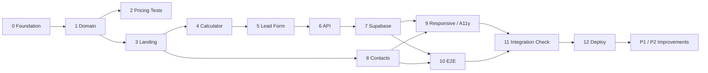

# Implementation Plan: “Clean Square”

## 0. Execution Contract

This plan is executable without inventing product constants. `TZ.md` remains the product source of truth and `ARCHITECTURE.md` remains the architecture source of truth. If those documents conflict, implementation pauses until the documents are reconciled or the user explicitly waives the conflict.
Stages 5–7 describe the preserved live lead path. Stage 8 adds the default non-submitting portfolio mode and gates that live path behind explicit `SITE_MODE=live`.

Canonical implementation data:

- cleaning IDs: `maintenance`, `deep`, `post-renovation`;
- add-on IDs: `windows`, `fridge`, `oven`; canonical field name: `addOns`;
- tariffs: maintenance 45 RUB/m², min 2500; deep 90 RUB/m², min 4500; post-renovation 120 RUB/m², min 6000;
- add-ons: windows 1500 RUB, fridge 700 RUB, oven 700 RUB;
- area: integer 10–500 inclusive;
- name: trimmed 2–80 characters;
- phone: trimmed 7–32 allowed characters, with 7–15 digits after formatting is removed;
- consent: exactly `true`;
- API: `201` success, `400/VALIDATION_ERROR`, `500/SUBMISSION_ERROR`;
- public contacts: env values read only through `src/config/site.ts`;
- all prices: integer RUB.

Technology baseline verified for 2026-09-23: Node 24 LTS, Next.js 16.3.6, framework-managed React compatible with that Next.js release (React 19.3 is current stable upstream), TypeScript strict, Tailwind 4.3, Zod 4.6, Vitest 5, Vite 8.3 as Vitest peer/test tooling, Playwright 1.63, Supabase PostgreSQL with server-only `sb_secret_...`, Vercel.

---

## 1. Planning Rules

Priority levels:

- **P0** — required for a working MVP.
- **P1** — quality improvements after the complete core flow works.
- **P2** — optional improvements only if time remains.

Complexity estimates:

- **S** — local, low-risk task.
- **M** — several related components or states.
- **L** — cross-cutting frontend/backend/integration work.

Implementation principle:

```text
make the complete business flow work first
→ verify it
→ polish it
```

Do not spend time on optional visuals before the user can complete:

```text
calculation → lead form → server → database → confirmation
```

---

## Stage 0. Project Initialization

**Priority:** P0  
**Complexity:** S

### Work

- Create a Next.js 16.3.6 project with App Router and TypeScript; keep the React packages selected as compatible by the scaffold rather than overriding them independently.
- Use Node.js 24 LTS.
- Enable strict TypeScript settings.
- Add Tailwind CSS 4.3.
- Configure ESLint using the current Next.js-compatible setup.
- Add Vitest 5 and Vite 8.3 as its explicit peer/test dependency.
- Add Playwright 1.63.
- Create the planned directory structure.
- Add `.env.example`.
- Add the four project documentation files.
- Commit the package lockfile.
- Confirm a production build succeeds before feature work begins.

### Result

A reproducible, runnable application skeleton.

### Done When

- [ ] Development server starts.
- [ ] Node runtime matches the chosen project baseline.
- [ ] TypeScript check passes.
- [ ] Linting passes.
- [ ] Production build passes.
- [ ] Unit-test command runs.
- [ ] Playwright test runner is installed and can start.
- [ ] Secrets are excluded from Git.
- [ ] Lockfile is committed.

### Dependencies

None.

---

## Stage 1. Domain Model and Configuration

**Priority:** P0  
**Complexity:** S

### Work

Create:

```text
src/domain/types.ts
src/domain/pricing.ts
src/config/pricing.ts
src/config/site.ts
```

Define:

- cleaning IDs and service data from Section 0;
- add-on IDs and prices from Section 0;
- the exact demo tariffs/minimum prices from Section 0;
- integer 10–500 m² area constraint;
- canonical lead field constraints;
- contact configuration that reads public env values only in `src/config/site.ts`;
- exactly three static fictional reviews with `name`, `text`, `rating`;
- no more than four benefits;
- the four canonical How It Works steps.

Implement the pure function:

```ts
calculatePrice(input)
```

### Result

Business rules exist independently from React components.

### Done When

- [ ] All tariffs and add-on prices have one source of truth and exactly match Section 0.
- [ ] No price constants are duplicated in components.
- [ ] Pricing function has no React, Next.js, or Supabase dependency.
- [ ] Same input always produces the same output.
- [ ] Invalid domain inputs cannot silently produce a valid calculation.

### Dependencies

Stage 0.

---

## Stage 2. Unit Tests for Pricing

**Priority:** P0  
**Complexity:** S

### Work

Configure Vitest 5 in Node environment and test:

- minimum price;
- calculation above minimum;
- maintenance cleaning;
- deep cleaning;
- post-renovation cleaning;
- no add-ons;
- one extra;
- several add-ons;
- 10 m² lower boundary;
- 500 m² upper boundary;
- invalid boundary handling, including fractional area;
- deterministic output.

### Result

Core pricing logic is protected before UI integration.

### Done When

- [ ] Pricing tests pass locally.
- [ ] Tests cover every pricing branch required by the specification.
- [ ] Tests use the real shared pricing configuration or intentionally controlled fixtures rather than duplicate production constants without reason.

### Dependencies

Stage 1.

Can run in parallel with Stage 3 after the domain contract stabilizes.

---

## Stage 3. Static Landing Page Skeleton

**Priority:** P0  
**Complexity:** M

### Work

Implement page sections:

- Hero;
- Services;
- Calculator section shell;
- Benefits;
- How It Works;
- Reviews;
- Lead section shell;
- final CTA near the end of the page;
- Footer.

Add:

- page container;
- typography baseline;
- spacing system;
- responsive layout;
- basic local UI primitives where useful;
- semantic heading structure;
- page title, meta description, semantic HTML, correct heading hierarchy, and favicon/basic metadata.

### Result

Complete static page structure with the intended information hierarchy.

### Done When

- [ ] All required sections exist, with exactly three reviews, no more than four benefits, and the four required How It Works steps.
- [ ] Final CTA offers a clear path back to calculation or forward to lead submission.
- [ ] Section order matches `TZ.md`.
- [ ] Hero CTA scrolls to the calculator section.
- [ ] Page works on mobile and desktop layouts.
- [ ] No unintended horizontal scrolling exists.
- [ ] No out-of-scope sections were introduced.

### Dependencies

Stage 1.

---

## Stage 4. Interactive Calculator

**Priority:** P0  
**Complexity:** M

### Work

Implement:

- cleaning-type selection;
- numeric area input;
- add-on selection;
- area validation;
- immediate recalculation;
- calculation summary;
- estimated-price label;
- CTA to the lead form.

The calculation state must remain available when moving to the lead section.

### Result

A complete client-side pricing experience.

### Done When

- [ ] All three cleaning types work.
- [ ] Each add-on can be toggled independently.
- [ ] Changing any input immediately updates the result.
- [ ] Minimum prices work correctly.
- [ ] Invalid area does not produce a valid calculation state.
- [ ] Result is clearly labeled estimated/preliminary.
- [ ] Lead-form CTA preserves the calculation.
- [ ] No network request is made merely to recalculate the preview.

### Dependencies

Stages 1 and 3.

---

## Stage 5. Lead Form UI and Validation

**Priority:** P0  
**Complexity:** M

### Work

Implement:

- name field;
- phone field;
- consent checkbox;
- calculation summary;
- client-side validation using the canonical name/phone/consent rules;
- `idle` state;
- `submitting` state;
- `success` state;
- `error` state.

Add a hidden honeypot only if it can be implemented without adding unnecessary complexity.

### Result

The form is complete from a UX perspective and ready for the real API.

### Done When

- [ ] Name, phone, area, and consent obey the canonical validation contract; fractional area is rejected.
- [ ] Consent is mandatory.
- [ ] Current calculation is shown with the form.
- [ ] Duplicate submit is blocked while the request is in flight.
- [ ] Failed submit does not erase user-entered form data.
- [ ] Failed submit does not erase calculation state.
- [ ] Labels, focus states, and error messages are accessible.

### Dependencies

Stage 4.

---

## Stage 6. Server Validation and Lead API

**Priority:** P0  
**Complexity:** L

### Work

Create:

```text
POST /api/leads
```

Add:

- Zod 4.6 schema;
- explicit allow-list validation for cleaning types and add-ons;
- canonical name/phone format and length constraints;
- area validation;
- consent validation;
- server-side price recalculation;
- normalized API responses;
- safe exception handling.

### Result

The browser sends untrusted lead input to a controlled server boundary.

### Done When

- [ ] Valid payload reaches the server orchestration layer.
- [ ] Invalid payload returns `400` with `VALIDATION_ERROR`.
- [ ] The server does not trust a browser-provided price.
- [ ] Server pricing uses the same domain pricing function.
- [ ] Unknown cleaning/add-on IDs are rejected.
- [ ] Valid submission returns `201` with `{ "success": true }`.
- [ ] Persistence/internal failure returns `500` with `SUBMISSION_ERROR`.
- [ ] Raw internal errors are not returned to the browser.

### Dependencies

Stages 1 and 5.

---

## Stage 7. Supabase Persistence

**Priority:** P0  
**Complexity:** M

### Work

- Create the Supabase project.
- Create the `leads` table with integer `area`, JSONB `add_ons`, integer `calculated_price`, boolean `consent`, and timestamp `created_at`.
- Add database constraints for area and consent.
- Create a server-only Supabase client.
- Use a current Supabase **secret API key (`sb_secret_...`)**.
- Add lead insert logic.
- Configure `SUPABASE_URL` and `SUPABASE_SECRET_KEY`.
- Verify no direct browser write path exists.

### Result

Submitted leads are actually persisted.

### Done When

- [ ] Valid submission creates one database row.
- [ ] `created_at` is generated.
- [ ] Saved price is the server-recalculated value.
- [ ] Server secret is absent from client bundles.
- [ ] Server secret is absent from Git.
- [ ] Database failure becomes a normalized UI error state.
- [ ] Retry works after a failed request.

### Dependencies

Stage 6.

---

## Stage 8. Portfolio Contact Controls and Live Contact Paths

**Priority:** P0  
**Complexity:** S

### Work

- Default to `SITE_MODE=portfolio`: keep Telegram/MAX buttons in the lead section and footer, show an in-page demo notice, and do not use external links.
- In portfolio mode, the lead form shows a demo notice without sending data and direct API submission fails closed.
- Preserve the live submission path behind explicit `SITE_MODE=live`.
- Store optional `NEXT_PUBLIC_PHONE` (currently disabled), `NEXT_PUBLIC_TELEGRAM_URL`, and `NEXT_PUBLIC_MAX_URL` through `src/config/site.ts` for live mode only.
- In live mode, add Telegram/MAX links to the lead section and footer with correct `target` / `rel` behavior; test supplied destinations.

### Result

Portfolio visitors can inspect the controls without sending data or leaving the site. Private live demos retain direct-contact and lead-submission paths.

### Done When

- [ ] Portfolio Telegram/MAX buttons stay on the site and show a demo notice.
- [ ] Portfolio lead form makes no request; direct API submissions do not persist.
- [ ] In live mode, Telegram and MAX controls open new tabs at their configured URLs with safe `rel` values; provider accessibility is checked before public live launch.
- [ ] Contact URLs are not duplicated as literals across components.
- [ ] Placeholder links are not shipped as production-ready links.

### Dependencies

Stage 3.

---

## Stage 9. Responsive and Accessibility Pass

**Priority:** P0  
**Complexity:** M

### Work

Check at minimum:

- approximately 320 px wide viewport;
- a modern Chrome/Edge mobile-equivalent viewport;
- tablet-sized viewport;
- desktop viewport.

Verify and fix:

- overflow;
- readable typography;
- touch target sizes;
- visible focus;
- input labels;
- keyboard navigation;
- heading hierarchy;
- contrast;
- form states;
- error messaging.

### Result

The primary flow works on mobile and desktop and is operable without a mouse.

### Done When

- [ ] No unintended horizontal overflow exists.
- [ ] Main flow can be completed with keyboard controls.
- [ ] Focus states are visible.
- [ ] Inputs have programmatic labels.
- [ ] Layout remains usable at the minimum supported width.
- [ ] Calculator and form remain visually prominent.

### Dependencies

Stages 3–8.

---

## Stage 10. End-to-End Tests

**Priority:** P0  
**Complexity:** M

### Work

Use Playwright 1.63 to automate the primary scenario:

```text
Hero
→ Calculator
→ valid calculation
→ Lead form
→ submission
→ success
```

Also verify:

- client validation;
- rejected/failed submission state;
- calculation persistence into the form;
- portfolio demo contact and submission behavior;
- live-mode Telegram and MAX destinations.

Prefer role- and label-based locators over brittle implementation selectors.

### Result

The main business flow is reproducibly testable.

### Done When

- [ ] Happy path passes.
- [ ] Pricing interaction is verified in the browser.
- [ ] Lead submission is verified.
- [ ] Success state is verified.
- [ ] Error state is verified.
- [ ] Portfolio controls stay on-site; live-mode Telegram and MAX targets are verified against configured non-placeholder destinations.
- [ ] Tests do not depend on arbitrary sleep delays.

### Dependencies

Stages 4–8.

---

## Stage 11. Integration and Security Check

**Priority:** P0  
**Complexity:** M

### Work

Run a complete manual and automated verification:

1. Open the site.
2. Use Hero CTA.
3. Complete a calculation.
4. Move to the lead form.
5. Submit a valid lead.
6. Confirm the database record.
7. Verify the stored price against server-side calculation.
8. Verify portfolio Telegram control and the live destination when live mode is enabled.
9. Verify portfolio MAX control and the live destination when live mode is enabled.
10. Check mobile layout.
11. Check desktop layout.
12. Run typecheck.
13. Run lint.
14. Run unit tests.
15. Run E2E tests.
16. Run production build.
17. Inspect browser console for unexpected errors.
18. Inspect the repository and generated client bundle for exposed secrets.
19. Verify API status/body contracts (`201`, `400/VALIDATION_ERROR`, `500/SUBMISSION_ERROR`).
20. Verify title/meta/semantic heading requirements.
21. Confirm no placeholder contact values are treated as production-ready.

### Result

A verified MVP candidate.

### Done When

Every applicable item in the `TZ.md` Definition of Done is satisfied.

### Dependencies

All previous P0 implementation stages.

---

## Stage 12. Deployment

**Priority:** P0  
**Complexity:** S

### Work

- Connect repository to Vercel.
- Configure preview/production environment variables.
- Deploy the Next.js application.
- Run portfolio smoke tests against the deployed URL without sending lead data.
- In a private live preview with synthetic data, verify the deployed Supabase connection and configured contact links.
- Deploy the non-submitting portfolio mode by default. Enforce the `TZ.md` personal-data gate before any public live deployment that accepts real names/phone numbers.

### Result

A working deployed portfolio environment; public real-data production is enabled only when the release gate is satisfied.

### Done When

- [ ] Deployed URL opens successfully.
- [ ] Calculator works in deployment.
- [ ] Portfolio deployment rejects lead submission; a private live preview persists a synthetic test lead.
- [ ] No server secret is exposed to the browser.
- [ ] Telegram and MAX links are real non-placeholder destinations before public live launch; portfolio controls do not navigate externally.
- [ ] No environment/configuration error appears.
- [ ] Public production accepting real personal data remains blocked while the privacy/consent gate is unsatisfied.

### Dependencies

Stage 11.

---

# Post-MVP

## Stage 13. Content Polish

**Priority:** P1  
**Complexity:** S

Possible improvements:

- refine microcopy;
- improve validation wording;
- refine CTA text;
- refine service descriptions;
- improve empty/loading/success copy.

Do not change the main business flow merely for stylistic variation.

---

## Stage 14. Visual Polish

**Priority:** P1  
**Complexity:** M

Allowed improvements:

- typography refinement;
- spacing refinement;
- small hover/focus transitions;
- image optimization;
- minor visual hierarchy improvements.

Do not add:

- decorative sections without a business purpose;
- heavy animation;
- unnecessary carousels;
- repeated CTAs with no new function.

---

## Stage 15. Lead Notification

**Priority:** P2  
**Complexity:** M

Optional only after the core lead flow is stable:

```text
successful database insert
        ↓
email or messenger notification
```

Persistence remains the source of truth.

Notification failure must not transform a successfully stored lead into a failed lead submission from the user's perspective.

---

## Dependency Map



---

## Requirement Traceability

| `TZ.md` requirement area | Implementation stage(s) | Verification stage(s) |
|---|---|---|
| Product/page structure, Hero, Services, Benefits, How It Works, Reviews, Final CTA, Footer | 1, 3 | 9, 11 |
| Calculator inputs, exact tariffs, validation, calculation summary | 1, 4 | 2, 10, 11 |
| Lead form and retry behavior | 5 | 10, 11 |
| Server validation and API contract | 6 | 10, 11 |
| Supabase persistence and secret handling | 7 | 10, 11, 12 |
| Telegram / MAX contacts | 8 | 10, 11, 12 |
| Responsive UX and accessibility | 3, 9 | 9, 11 |
| Basic SEO | 3 | 11 |
| Technical baseline / lockfile | 0 | 11, 12 |
| Deployment and personal-data gate | 12 | 12 |
| Explicit out-of-scope constraints | all stages | 11 |

No architecture decision in `ARCHITECTURE.md` is considered complete unless it maps to one of the stages above or is an explicit cross-cutting constraint verified in Stage 11.

---

## Final Planning Rule

The project is not considered successful because all sections look finished.

It is successful when this path works and has been verified:

```text
user
→ estimate
→ lead form
→ server validation
→ server price calculation
→ database insert
→ confirmation
```
