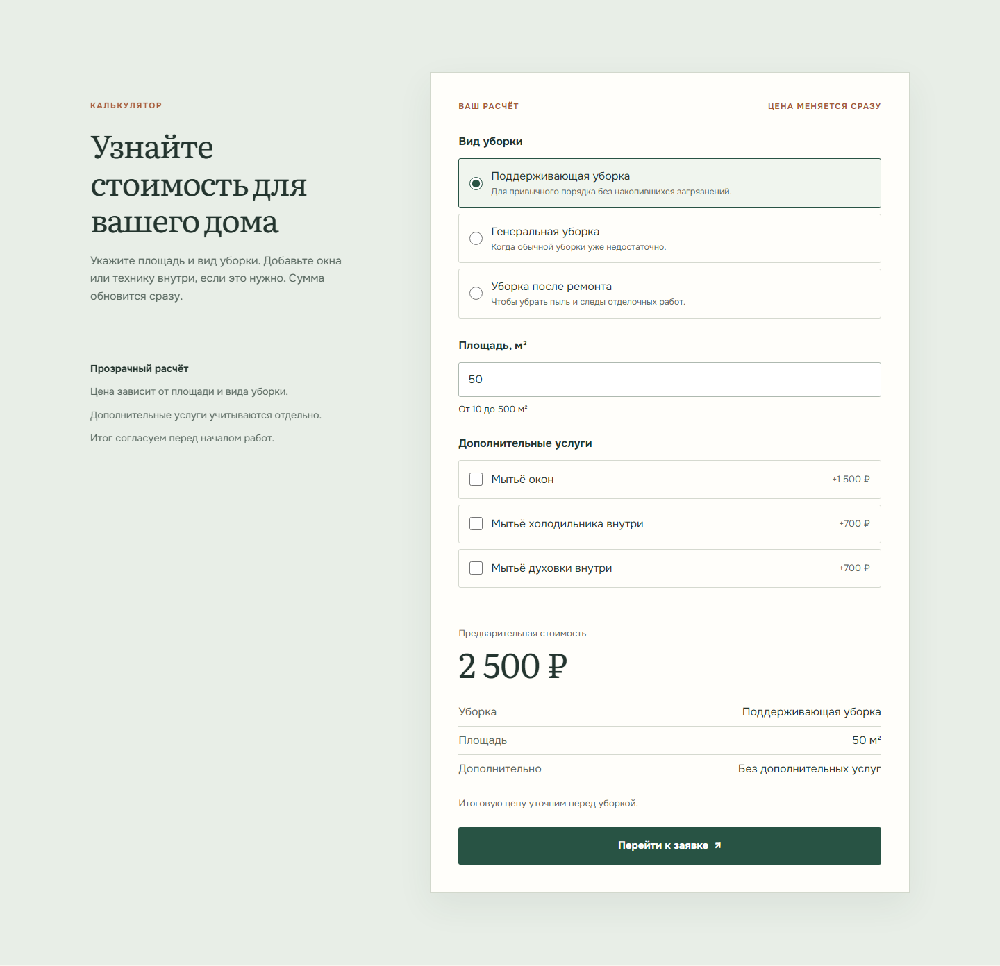
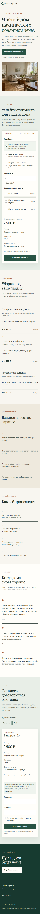

# Clean Square

A one-page cleaning-service website built around one useful question: **what might this cleaning cost?** Choose a service, enter the area, add any extras, and see an estimated price before opening the request form.

**[View the live site](https://clean-square.vercel.app)**


<details>
<summary>Calculator and mobile view</summary>





</details>

## What works

- Three cleaning types, three add-ons, instant pricing, and a calculation summary carried into the lead form.
- Client feedback, submission progress, confirmation, and retry after failure in live mode.
- Server-side validation and price recalculation before a lead is written to Supabase PostgreSQL.
- Responsive layout, keyboard-accessible controls, and a clear distinction between an estimate and the final agreed price.

The company, testimonials, and prices are fictional. The public site runs in **`portfolio` mode**: form and contact controls demonstrate their states without sending data or navigating to external contacts, and direct API submissions are rejected. An explicit **`live` mode** enables the full persistence path for private tests with synthetic data. Public collection of real contacts is subject to the [deployment gate](TZ.md#deployment-gate).

## Under the hood

Next.js 16 App Router, React, TypeScript, Tailwind CSS 4, Zod 4, Supabase PostgreSQL, Vitest, Playwright, and Vercel. Static sections are server-rendered; a small client boundary shares calculator inputs with the form. Tariffs live in [one configuration file](src/config/pricing.ts), and a pure [pricing function](src/domain/pricing.ts) runs in both browser and server. The browser never receives the Supabase secret or supplies an authoritative total. See the [architecture](ARCHITECTURE.md) and [product contract](TZ.md) for details.

Unit tests cover pricing, field validation, API responses, persistence, and contact configuration. Playwright checks the calculator, form, portfolio safeguards, and mocked live flow. An opt-in integration test creates, verifies, and removes a synthetic Supabase lead. GitHub Actions runs non-secret checks on pushes and pull requests.

## Run locally

Use Node.js 24 and npm:

```bash
npm ci
cp .env.example .env.local
npm run dev
```

The example file starts in portfolio mode without credentials. For private live testing, set `SITE_MODE=live`, `SUPABASE_URL`, and the server-only `SUPABASE_SECRET_KEY` in `.env.local`, then apply the [leads migration](supabase/migrations/20260924000000_create_leads.sql). Optional `NEXT_PUBLIC_TELEGRAM_URL` and `NEXT_PUBLIC_MAX_URL` configure live contact links. Environment values are read at build/deploy time; never commit secrets or use real contacts in tests.

```bash
npm run typecheck
npm run lint
npm test
npm run test:e2e
npm run build
```

`npm run test:e2e` uses portfolio mode by default. With `SITE_MODE=live`, it checks live behavior; `RUN_LIVE_INTEGRATION=1` also runs the synthetic database test.
